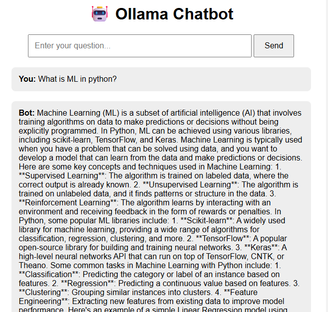

# 🤖 Ollama Flask Chatbot

A local AI chatbot web application built using **Python, Flask, and Ollama**. This project integrates the **Llama 3.2 1B** language model into a ChatGPT-style interface, allowing users to interact with an AI assistant through a web browser.

## 📸 Project Screenshot

Add your chatbot screenshot to the `screenshots` folder and name it `chatbot.png`.



## ✨ Features

- 🤖 AI-powered conversations using Llama 3.2 1B
- 🌐 ChatGPT-style web interface
- ✏️ Create new conversations
- 💬 View and open recent chats
- 💾 Save conversation history locally using JSON
- 🗑️ Delete conversations
- 📝 Automatically generate chat titles from the first question
- 📋 Copy user messages and AI responses
- 📱 Responsive interface
- 🏠 Run AI locally using Ollama

## 🛠️ Tech Stack

| Technology | Purpose |
|---|---|
| Python | Backend programming |
| Flask | Web application framework |
| Ollama | Local language model integration |
| Llama 3.2 1B | AI language model |
| HTML | Web page structure |
| CSS | User interface styling |
| JavaScript | Copy-to-clipboard functionality |
| JSON | Local conversation storage |

## 📁 Project Structure

```text
ollama-flask-chatbot/
│
├── app.py
├── llama.py
├── requirements.txt
├── README.md
├── .gitignore
│
├── templates/
│   └── index.html
│
├── static/
│   └── style.css
│
├── chats/
│   └── chat_history.json
│
└── screenshots/
    └── chatbot.png
```

> **Note:** The `venv/` folder should not be uploaded to GitHub. The `chats/` folder contains local conversation history and may contain personal information. Consider keeping it out of your public repository.

## ⚙️ Installation and Setup

### 1. Clone the repository

```bash
git clone https://github.com/YOUR-USERNAME/ollama-flask-chatbot.git
```

Replace `YOUR-USERNAME` with your GitHub username.

### 2. Open the project folder

```bash
cd ollama-flask-chatbot
```

### 3. Create a virtual environment

```bash
python -m venv venv
```

### 4. Activate the virtual environment

For Windows PowerShell:

```powershell
.\venv\Scripts\Activate.ps1
```

### 5. Install Python dependencies

```bash
python -m pip install -r requirements.txt
```

## 🦙 Ollama Setup

Install Ollama on your computer and make sure it is running.

Download the required model:

```bash
ollama pull llama3.2:1b
```

Check that the model is available:

```bash
ollama list
```

Make sure `llama3.2:1b` appears in the list.

## ▶️ Run the Application

Start the Flask application:

```bash
python app.py
```

Open the following URL in your browser:

```text
http://127.0.0.1:5000
```

You can now start chatting with your local AI assistant.

## 💬 How It Works

```text
User
  ↓
Chat Interface (HTML/CSS)
  ↓
Flask Application (app.py)
  ↓
Chat Logic (llama.py)
  ↓
Ollama
  ↓
Llama 3.2 1B
  ↓
AI Response
  ↓
Display Response in Chat
```

## 🗂️ Conversation Management

The application stores conversations in a local JSON file.

- New conversations are created when the user starts a chat.
- Empty conversations are not saved until the first message is sent.
- The first question becomes the conversation title.
- Existing conversations can be opened from Recents.
- Conversations can be deleted from the sidebar.

## 📋 Copy Messages

The Copy button allows users to copy their questions and AI responses to the clipboard.

Copied text can be pasted into another application using `Ctrl + V`.

## 🔐 Privacy

This project is designed to run the language model locally through Ollama. Conversation history is stored locally in a JSON file.

Avoid committing private conversation history, API keys, passwords, or other sensitive information to a public repository.

## 📦 Main Dependencies

- Flask
- Ollama Python package

Install the dependencies with:

```bash
pip install -r requirements.txt
```

## 👩‍💻 Author

**Shivani Patil**

